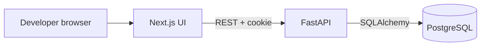

# V1 architecture

The browser loads the Next.js interface and calls the FastAPI REST API. The API validates input, checks the authenticated user and ownership, applies business rules, and stores data in PostgreSQL. Next.js handles pages, forms, and interactive board behavior; it does not decide whether the user may access a project. FastAPI owns authorization and data changes. Alembic records database schema changes.

## Decisions

| Decision | Reason |
| --- | --- |
| Separate frontend and backend folders | Keeps UI and API boundaries clear and allows independent local development. |
| PostgreSQL with SQLAlchemy and Alembic | Relational ownership and issue data need foreign keys and reproducible migrations. |
| Email/password with server-managed session cookie | Avoids putting bearer tokens in browser storage; later GitHub OAuth can add an identity method. |
| Single project owner in V1 | Gives assignment a clear meaning and avoids pretending team permissions exist. |
| Archive projects and issues | Preserves comments and historical issue references. |
| No worker or Redis yet | V1 actions are ordinary request/response operations. |

## Authentication and request path

Registration validates email/password and stores a password hash. Login checks the hash, creates a server-side session with an expiring random token whose digest is stored in the database, and sends the raw token in a Secure, HttpOnly, SameSite cookie in production. Logout revokes the session. The backend resolves the session for each protected request and filters resource queries by owner; nested issue and comment endpoints verify the parent project's owner. Use a same-origin deployment or a controlled proxy for production cookies. During local development, the two localhost ports may use credentialed CORS with one exact frontend origin. The state-changing API uses an Origin check or CSRF token in addition to SameSite cookies. Session and password reset details will be finalized during the auth implementation.

Example: moving an issue sends `PATCH /api/projects/{project_id}/issues/{issue_id}` with a new status. FastAPI authenticates the user, checks project ownership and issue membership, validates the status, commits the change, and returns the updated issue. A page refresh fetches the stored value.

## Failure and security behavior

Use 401 for unauthenticated calls, 404 for inaccessible or missing resources, 422 for invalid input, and 409 for uniqueness conflicts. Return `{ "error": { "code": "...", "message": "..." } }` for expected API failures. Do not expose raw exception or secret text. Parameterized ORM queries, bounded fields, secure cookie settings, explicit CORS origins, and server-side ownership checks are required. Add database indexes on owner/project/status paths after observing actual queries.

## Future boundaries

GitHub adapters will live behind backend services; GitHub credentials stay on the server. AI analysis will consume project context through backend APIs. Repository indexing and workers arrive only when asynchronous processing is needed. Neither future area changes the V1 ownership rules.
