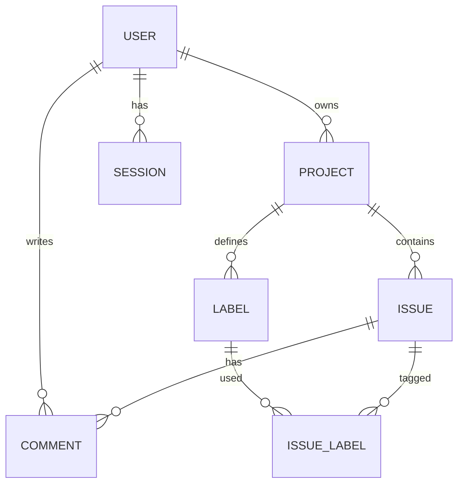

# V1 database relationship design

Each project has exactly one owner. An issue belongs to exactly one project. A label belongs to one project and can tag many issues in that project. A comment belongs to one issue and records its author. An issue may optionally point to the project owner as assignee in V1; when collaboration is added, membership rules must replace this limitation. Every issue-label link must involve a label from the same project as its issue; the service enforces this and a future composite database constraint can reinforce it.

| Table | Important columns and constraints |
| --- | --- |
| users | `id` UUID PK, `email` unique case insensitive, `password_hash`, `display_name`, timestamps |
| sessions | `id` UUID PK, `user_id` FK, `token_hash` unique, `expires_at`, `revoked_at`, `created_at` |
| projects | `id` UUID PK, `owner_id` FK, `name`, `description`, `archived_at` nullable, timestamps |
| issues | `id` UUID PK, `project_id` FK, `title`, `description`, `type`, `status`, `priority`, `assignee_id` nullable FK, `archived_at` nullable, timestamps |
| labels | `id` UUID PK, `project_id` FK, `name`, `color`, unique `(project_id, name)` |
| issue_labels | `(issue_id, label_id)` composite PK and foreign keys |
| comments | `id` UUID PK, `issue_id` FK, `author_id` FK, `body`, timestamps |

`status` is one of `backlog`, `todo`, `in_progress`, `review`, `done`; `type` is `bug`, `feature`, `task`; `priority` is `low`, `medium`, `high`, `urgent`. Store timestamps in UTC. Generate IDs server-side. Keep authorship when archiving, and do not hard-delete a user who owns retained history. Foreign keys and indexes support project issue queries and session expiration.

The first migration is intentionally postponed until we implement database connectivity. This document defines relationships and constraints before choosing exact ORM declarations.
