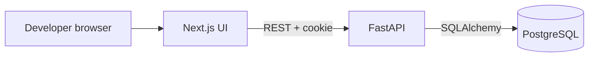

# V1 architecture

The browser loads the Next.js interface and calls the FastAPI REST API. The API validates input, checks the authenticated user and ownership, applies business rules, and stores data in PostgreSQL. Next.js handles pages, forms, and interactive board behavior; it does not decide whether the user may access a project. FastAPI owns authorization and data changes. Alembic records database schema changes.

## Decisions

| Decision | Reason |
| --- | --- |
| Separate frontend and backend folders | Keeps UI and API boundaries clear and allows independent local development. |
| PostgreSQL with SQLAlchemy and Alembic | Relational ownership and issue data need foreign keys and reproducible migrations. |
| Email/password with server-managed session cookie | Avoids putting bearer tokens in browser storage; later GitHub OAuth can add an identity method. |
| Single project owner in V1 | Gives assignment a clear meaning and avoids pretending team permissions exist. |
| Archive projects and issues | Preserves comments and historical issue references. |
| No worker or Redis yet | V1 actions are ordinary request/response operations. |

## Authentication and request path

Registration validates email/password and stores an Argon2id hash. Login verifies
that hash with a case-insensitive email lookup; nonexistent emails undergo a dummy
Argon2 verification and receive the same generic 401 as incorrect passwords.
Login creates a 256-bit random token, stores only its SHA-256 digest in PostgreSQL,
and returns the token in an HttpOnly, SameSite=Lax, host-only cookie named
`devpilot_session`, Path `/`. The fixed lifetime is seven days; each request checks
database expiration and revocation. Logout revokes the presented session and clears
the cookie. Re-login replaces only the session presented by that browser.

Routes handle HTTP and public response schemas; `services/auth.py` owns credential
verification and session persistence; `models.py` and `database.py` own ORM data and
database connections. `dependencies.py` connects cookie authentication to protected
routes. `security.py` owns cookie attributes, exact-origin CSRF enforcement and
credentialed CORS. Auth responses are not cacheable. No table creation runs at API
startup, and no raw tokens or password hashes are included in response bodies.

All unsafe methods require one Origin equal to `FRONTEND_ORIGIN` or `API_ORIGIN`.
Missing, null, duplicate and foreign origins are rejected with 403; there is no
Referer fallback. This applies to register/login as well as authenticated writes
such as logout, so login CSRF is covered. The check uses configured origins, never
untrusted Host/forwarded headers. CORS allows credentials only for the exact
frontend origin. See the [OWASP origin-check guidance](https://cheatsheetseries.owasp.org/cheatsheets/Cross-Site_Request_Forgery_Prevention_Cheat_Sheet.html).

Locally, use `http://localhost:3000` and `http://localhost:8000` together. Cookie
Secure is false for this HTTP environment. Frontend fetch calls must later use
`credentials: "include"`; SameSite=Lax works with these same-site localhost ports.
Production uses `APP_ENV=production`, which enables Secure cookies and requires
explicit HTTPS frontend/API origins without paths or trailing slashes. Deploy
same-origin via a controlled proxy or use same-site HTTPS subdomains; unrelated
cross-site domains are not supported by the Lax cookie policy. TLS termination
must preserve the browser Origin. Password reset and rate limiting are future work.

Current-user lookup resolves only the authenticated user's public fields. Future
project/issue endpoints must additionally filter resources by owner and verify
parent ownership; those endpoints and authorization rules are not implemented yet.

Example: moving an issue sends `PATCH /api/projects/{project_id}/issues/{issue_id}` with a new status. FastAPI authenticates the user, checks project ownership and issue membership, validates the status, commits the change, and returns the updated issue. A page refresh fetches the stored value.

## Failure and security behavior

Use 401 for unauthenticated calls, 404 for inaccessible or missing resources, 422 for invalid input, and 409 for uniqueness conflicts. Return `{ "error": { "code": "...", "message": "..." } }` for expected API failures. Do not expose raw exception or secret text. Parameterized ORM queries, bounded fields, secure cookie settings, explicit CORS origins, and server-side ownership checks are required. Add database indexes on owner/project/status paths after observing actual queries.

## Future boundaries

GitHub adapters will live behind backend services; GitHub credentials stay on the server. AI analysis will consume project context through backend APIs. Repository indexing and workers arrive only when asynchronous processing is needed. Neither future area changes the V1 ownership rules.
