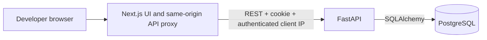

# V1 architecture

Staging uses a Node Next.js route at `/api/[...path]` to forward same-origin browser
requests to Render. Server-only configuration and a shared proxy secret protect
the backend; validated Vercel client-IP metadata drives rate limits. Cookies and
Origin pass through unchanged, responses are uncached, and mutation failures are
never automatically retried. [Trust and deployment contract](staging.md).

```mermaid
flowchart LR
  U["Developer browser"] --> W["Next.js UI and same-origin API proxy"]
  W -->|"REST + cookie + authenticated client IP"| A["FastAPI"]
  A -->|"SQLAlchemy"| D[(PostgreSQL)]
```

The browser loads the Next.js interface and calls the FastAPI REST API. The API validates input, checks the authenticated user and ownership, applies business rules, and stores data in PostgreSQL. Next.js handles pages, forms, and interactive board behavior; it does not decide whether the user may access a project. FastAPI owns authorization and data changes. Alembic records database schema changes.

## Decisions

| Decision | Reason |
| --- | --- |
| Separate frontend and backend folders | Keeps UI and API boundaries clear and allows independent local development. |
| PostgreSQL with SQLAlchemy and Alembic | Relational ownership and issue data need foreign keys and reproducible migrations. |
| Email/password with server-managed session cookie | Avoids putting bearer tokens in browser storage; later GitHub OAuth can add an identity method. |
| Single project owner in V1 | Gives assignment a clear meaning and avoids pretending team permissions exist. |
| Archive projects | Preserves issues and comments; per-issue archival is deferred. |
| No worker or Redis yet | V1 actions are ordinary request/response operations. |

## Authentication and request path

Registration validates email/password and stores an Argon2id hash. Login verifies
that hash with a case-insensitive email lookup; nonexistent emails undergo a dummy
Argon2 verification and receive the same generic 401 as incorrect passwords.
Login creates a 256-bit random token, stores only its SHA-256 digest in PostgreSQL,
and returns the token in an HttpOnly, SameSite=Lax, host-only cookie named
`devpilot_session`, Path `/`. The fixed lifetime is seven days; each request checks
database expiration and revocation. Logout revokes the presented session and clears
the cookie. Re-login replaces only the session presented by that browser.

Routes handle HTTP and public response schemas; `services/auth.py` owns credential
verification and session persistence; `models.py` and `database.py` own ORM data and
database connections. `dependencies.py` connects cookie authentication to protected
routes. `security.py` owns cookie attributes, exact-origin CSRF enforcement and
credentialed CORS. Auth responses are not cacheable. No table creation runs at API
startup, and no raw tokens or password hashes are included in response bodies.

All unsafe methods require one Origin equal to `FRONTEND_ORIGIN` or `API_ORIGIN`.
Missing, null, duplicate and foreign origins are rejected with 403; there is no
Referer fallback. This applies to register/login as well as authenticated writes
such as logout, so login CSRF is covered. The check uses configured origins, never
untrusted Host/forwarded headers. CORS allows credentials only for the exact
frontend origin. See the [OWASP origin-check guidance](https://cheatsheetseries.owasp.org/cheatsheets/Cross-Site_Request_Forgery_Prevention_Cheat_Sheet.html).

Locally, use `http://localhost:3000` and `http://localhost:8000` together. Cookie
Secure is false for this HTTP environment. Frontend fetch calls use
`credentials: "include"`; SameSite=Lax works with these same-site localhost ports.
Production uses `APP_ENV=production`, which enables Secure cookies and requires
explicit HTTPS frontend/API origins without paths or trailing slashes. Deploy
same-origin via a controlled proxy or use same-site HTTPS subdomains; unrelated
cross-site domains are not supported by the Lax cookie policy. TLS termination
must preserve the browser Origin. Password reset remains future work. Authentication
rate limits now use PostgreSQL; see [limits and proxy trust](auth-rate-limits.md).

Current-user lookup resolves only the authenticated user's public fields.
Project routes reuse this session dependency; services/projects.py filters every
read by the session's user_id and assigns that owner when creating. Caller-supplied
owner IDs are never used. Missing and foreign-owned projects both return 404.
Issue endpoints verify parent ownership before list/read/write operations and
scope direct issue IDs to that same project.

Example: moving an issue sends `PATCH /api/projects/{project_id}/issues/{issue_id}` with a new status. FastAPI authenticates the user, checks project ownership and issue membership, validates the status, commits the change, and returns the updated issue. A page refresh fetches the stored value.

## Failure and security behavior

Use 401 for unauthenticated calls, 404 for inaccessible or missing resources, 422 for invalid input, and 409 for uniqueness or resource-state conflicts. Return `{ "error": { "code": "...", "message": "..." } }` for expected API failures. Do not expose raw exception or secret text. Parameterized ORM queries, bounded fields, secure cookie settings, explicit CORS origins, and server-side ownership checks are required. Add database indexes on owner/project/status paths after observing actual queries.

## Future boundaries

GitHub adapters will live behind backend services; GitHub credentials stay on the server. AI analysis will consume project context through backend APIs. Repository indexing and workers arrive only when asynchronous processing is needed. Neither future area changes the V1 ownership rules.

## Workspace implementation

Project HTTP routes live in routes/projects.py, input/output contracts in
schemas/projects.py, and queries/commits in services/projects.py. models.py owns
the ORM definition; migration 0003 creates projects and 0004 adds nullable
archived_at. Project responses use no-store.
Listing uses bounded limit/offset pagination ordered by created_at and id,
newest first; the owner/date/id index supports that query. Offset pagination is
not a snapshot: concurrent creation/archive/restore can shift page boundaries.
Active/archived filtering occurs before pagination. Every mutation first locks
the owner-scoped row, serializing edits and archive transitions. The service
rejects edits while archived and makes repeated transitions no-ops. Partial edits
use only explicitly provided fields; public schemas never expose ownership.
PATCH is allowed by CORS while retaining the exact-Origin checks on every write.
Unexpected route failures are rendered by a ServerErrorMiddleware boundary inside
SecurityMiddleware's CORS/no-store handling. They return a generic 500
`internal_error` envelope without diagnostic details, then re-raise for server
logging. This prevents a server error from becoming an unreadable CORS failure.

The frontend Workspace component verifies /api/users/me before mounting private
page content. The useApi hook handles loading, retries and 401 redirects. Cleanup
ignores stale results rather than aborting requests, preserving the Chrome fix.
Direct private URLs are restored after login using an allowlisted internal next
path. The server remains the authorization boundary. No identity or project data
is stored in localStorage. ProjectList and ProjectForm share the API client,
buttons, fields and CSS design tokens. The dashboard shows up to four actual
active projects ordered by project update time, plus real aggregated issue counts
and up to six recently updated issues; the full project list uses twenty per page.
Account reuses the workspace shell.
ProjectForm shares create/edit validation and retains unsaved input on recoverable
errors. ProjectDetail owns mutation state and displays only server-returned saved
values. Project pages focus on routing/data fetching. ConfirmDialog uses native
showModal for focus containment, starts on Keep active, supports Escape before
submission, and returns focus on close. The Archived view is URL-addressable and
resets pagination when switching views. No drafts or private project data are
stored in browser storage.

Local migrations through 0006 are approved and applied. Alembic reports
0006_comments_labels (head) and no new upgrade operations. No browser was
connected for interaction, accessibility, or visual acceptance; those checks are
still pending even though backend tests and the production build passed.

## Issues implementation

`routes/issues.py` handles the nested HTTP endpoints; `schemas/issues.py` defines
strict allowed inputs/public responses; `services/issues.py` owns authorization,
queries and commits; `models.py` and migration 0005 own persistence. Issue writes
first lock the owner-scoped project row, then reject archived parents and validate
issue membership before mutation. This serializes creation/edit/status updates
with archive/restore. Parent ownership is never accepted from request JSON.
List/detail remain readable while archived; mismatched IDs return 404.

The detail page composes Workspace and IssueDetail. ProjectIssues integrates
paginated real issue data and creation into ProjectDetail. IssueForm reuses shared
fields/buttons, validates the documented enums, retains input on recoverable
failure, guards duplicate submission, and ignores completion after unmount.
IssueDetail shows saved data and edits/status changes through the same form.
No mutation is optimistic: success uses the API's returned record. Plain-text
descriptions are rendered as React text. No new runtime dependencies are added.

`lib/issues.ts` owns the typed frontend contract and request helpers. Safe login
return URLs now include nested issue details. Existing useApi/AuthForm/welcome
stale-result protection is unchanged; effect cleanup never reintroduces abort().
Local tests with simulated DOM/fetch/router are not real browser verification.

## Project Kanban board

ProjectDetail composes ProjectIssueViews inside Suspense. The URL selects List
(default) or Board (`?view=board`), survives refresh and safe login returns, and
remounts the data view when switching. Existing route pages remain unchanged.
The user confirmed the earlier real-browser issue journey; board-specific browser
acceptance remains unverified by this agent.

IssueBoard composes BoardColumn and its card. useIssueBoard owns bounded paging,
confirmed status mutations, error states, and stale-result protection. Native
HTML desktop drag events call the same move function as the labeled select/form;
no drag dependency is necessary. External drops are ignored. Mobile uses an
explicit column selector and the same keyboard-operable Move to controls.

Loading starts with 100 newest issues across all statuses. Each Load older issues
action requests at most 100 more; there is no automatic all-project fetch loop or
arbitrary total cap. Loaded cards accumulate on explicit demand, so memory grows
with the number requested. Counts are labeled loaded, and has_more is always
exposed through the load action and explanatory text. All five columns use this
same filtered ordered collection. Without a status filter, status moves do not
change page boundaries. With a status filter, a confirmed move out of that status
removes the card and decrements the next offset to avoid skipping a matching row.
Offset pagination is not a snapshot: concurrent issue creation can shift pages.
Overlapping IDs are de-duplicated, keeping newer saved versions; Refresh board
starts again at offset zero to discover work created in another tab.

One load or move request is allowed at a time, guarded synchronously by a ref.
Updates use only the existing PATCH status field and returned saved issue. Cards
do not move optimistically; failed moves preserve the last confirmed state and
chosen destination. Uncertain network failures offer an idempotent retry or refresh.
Map insertion order preserves exact API creation/UUID ordering, including
sub-millisecond timestamps, without adding ordering fields. Other tabs use
last-confirmed-write behavior; live synchronization/version conflict detection
is outside scope. Refresh or re-enter the view to obtain their changes.

Effect generations ignore obsolete results on Strict Mode replay, route changes,
archival-state remounts and unmount. Cleanup does not abort fetch. Archived boards
disable all movement; a server 409 also blocks stale active controls and explains
restoration. Backend ownership/session/CSRF/archive locks remain unchanged.

## Comments and labels

Organization routes/schemas/services keep the existing layering. Services check
the project owner, acquire the same project lock for writes, reject archived
parents, and then verify issue/comment/label membership. Comment updates/deletes
also check author_id. Label uniqueness is enforced in PostgreSQL and only that
specific constraint maps to label_name_taken; unrelated errors still propagate.
The existing CORS error boundary is retained; PUT/DELETE join the allowed methods.

Issue.labels is a read-only ORM relationship loaded with selectin batching.
Issue list/board responses use one additional label query for the whole bounded
page. Comment authors use a joined relationship; public schemas return only ID
and display name. Assignment changes commit explicitly then return the saved
label array. They do not replace whole issue records or modify project contents.

ProjectIssueViews adds a Labels view. Label management lives there, so switching
back to List/Board refetches names and assignments while ordinary board moves
retain their paging/state model. IssueLabels updates only local assigned labels
after a confirmed response. Available labels are paged. CommentForm and LabelForm
retain drafts after errors and use a ref guard against duplicate submissions.
IssueComments updates an edited item locally and refreshes only its comment page
after adding/deleting. No mutation refetches the whole project.

useOrganizationAction ignores obsolete async completions with an effect
generation and never aborts cleanup. useApi, the board hook, auth and welcome
cleanup fixes are unchanged. Shared LabelBadges render text consistently on
details, lists and cards. ConfirmDialog now accepts action wording while keeping
its native modal focus handling and the original archive defaults.

No runtime dependency is added. Cross-tab edits become visible on refresh or
view re-entry; no live synchronization is promised. Code requires migration 0006,
which is now approved, applied and verified on local devpilot.

## Filtering and real-data dashboard

Issue routes validate enums, UUIDs, search length and page bounds; issue services
apply owner authorization and all SQL predicates before limit/offset. Label
membership uses EXISTS, avoiding duplicate rows and keeping batch label loading.
No schema or authentication changes are required.

lib/issueFilters.ts owns URL parsing/serialization. ProjectIssueViews composes
IssueFilters plus List/Board. Apply pushes a history entry; navigation preserves
filters even through Labels. Changing the canonical query remounts the data view,
resets pagination and invalidates old requests. The form is also keyed by the
query so Back/Forward updates saved controls. Label choices load 20 per page and
retain an off-page selection. Invalid URL values remain correctable; empty
results distinguish no matching issues from a project with no issues.

Board loading uses the same server filters, 100 at a time across all five columns.
Moves remain confirmed and serialized. A successful move outside a status filter
removes the card, announces why, focuses the board heading, and decreases the next
offset by one. Failures preserve cards. Other clients can still shift offset
boundaries; refresh restarts paging. Existing generation guards and useApi stale
result handling remain intact without aborting effect cleanup.

routes/dashboard.py delegates to services/dashboard.py and returns typed schemas.
Four bounded-result business queries count projects, group issue counts by status,
and select four recent projects/six recent issues. Recent issues select columns
only, without loading labels or N+1 queries. Normal session lookup is additional.
Aggregates still scan qualifying rows; the four statements are ordinary reads,
not a promised cross-query snapshot during concurrent writes. Dashboard renders
server counts through the existing Workspace/useApi boundary, with retry and
empty-account actions; its route remains a composition wrapper.

## Release tooling

PR/push checks and supported runtime pins are in .github/workflows/checks.yml,
.python-version and .nvmrc. Exact Python hashes and npm lock resolution support
fresh installations. All six frontend harnesses are tracked and run through
npm test; local .local-checks is no longer a test dependency. HTTP routing errors
now use the same sanitized envelope. useApi catches failed session navigation
while preserving stale-result cleanup. See [release review](release-readiness.md)
and [production configuration](deployment.md); CI does not deploy.

## Authentication limiter integration

The auth routes call services/rate_limits.py before credential services. A short
PostgreSQL transaction spends IP/email budgets and commits before expensive work;
no account existence lookup or per-worker counter is used. client_ip.py resolves
only the untouched ASGI peer or a bounded trusted-proxy chain, so deployment must
use --no-proxy-headers and the explicit application allowlist. Expiry maintenance
is a bounded command scheduled externally, not a new worker dependency. Storage
failure prevents new auth attempts. Existing session, ownership, CSRF and Chrome
stale-result behavior are unchanged. See [operational contract](auth-rate-limits.md).
