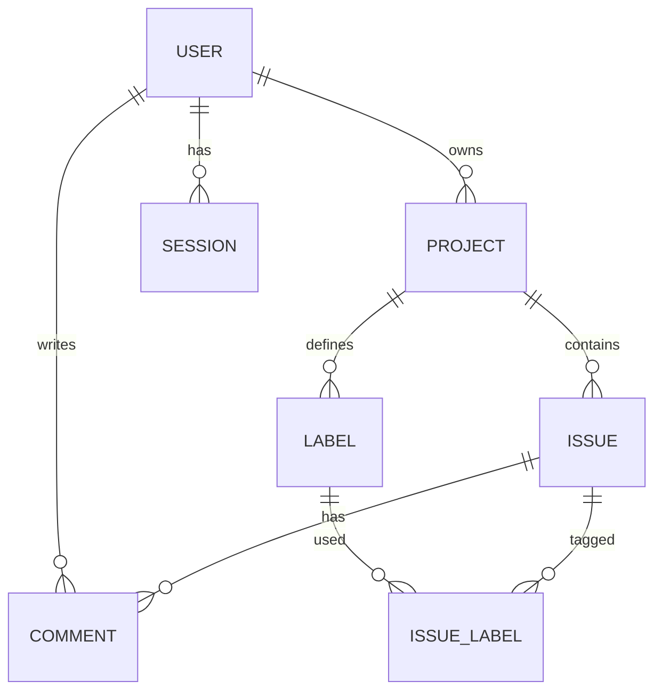

# V1 database relationship design

Each project has exactly one owner. An issue belongs to exactly one project. A label belongs to one project and can tag many issues in that project. A comment belongs to one issue and records its author. An issue may optionally point to the project owner as assignee in V1; when collaboration is added, membership rules must replace this limitation. Every issue-label link must involve a label from the same project as its issue; the service enforces this and a future composite database constraint can reinforce it.

| Table | Important columns and constraints |
| --- | --- |
| users | `id` UUID PK, `email` unique case insensitive, `password_hash`, `display_name`, timestamps |
| sessions | `id` UUID PK, `user_id` FK, `token_hash` unique, `expires_at`, `revoked_at`, `created_at` |
| projects | `id` UUID PK, `owner_id` FK, `name`, `description`, `archived_at` nullable, timestamps |
| issues | `id` UUID PK, `project_id` FK, `title`, `description`, `type`, `status`, `priority`, `assignee_id` nullable FK, `archived_at` nullable, timestamps |
| labels | `id` UUID PK, `project_id` FK, `name`, `color`, unique `(project_id, name)` |
| issue_labels | `(issue_id, label_id)` composite PK and foreign keys |
| comments | `id` UUID PK, `issue_id` FK, `author_id` FK, `body`, timestamps |

`status` is one of `backlog`, `todo`, `in_progress`, `review`, `done`; `type` is `bug`, `feature`, `task`; `priority` is `low`, `medium`, `high`, `urgent`. Store timestamps in UTC. Generate IDs server-side. Keep authorship when archiving, and do not hard-delete a user who owns retained history. Foreign keys and indexes support project issue queries and session expiration.

The first migration, `0001_create_users`, implements only `users`: a backend-generated
UUID primary key, required `email` (up to 320 characters), `password_hash` (text),
`display_name` (up to 100 characters), and required `created_at`/`updated_at`
timestamps with time zone and database `now()` defaults. A unique expression index
on `lower(email)` enforces case-insensitive uniqueness without an extension.
SQLAlchemy updates `updated_at` on ORM writes; direct SQL updates must set it
explicitly. Database sessions use UTC. Raw SQL inserts must supply a UUID.
Migration `0002_create_sessions` adds persistent authentication sessions. It depends
on `0001_create_users`, which is unchanged:

| Column | Definition |
| --- | --- |
| `id` | Required UUID primary key, generated by the backend |
| `user_id` | Required UUID foreign key to `users.id`; no cascading deletion |
| `token_hash` | Required 64-character SHA-256 hex digest; unique index |
| `expires_at` | Required timestamp with time zone; seven days after login |
| `revoked_at` | Nullable timestamp with time zone; set on logout or session replacement |
| `created_at` | Required timestamp with time zone; database `now()` default |

Indexes cover unique token lookup, `user_id`, and `expires_at`. The raw token is
generated from 32 cryptographically random bytes and exists only in the cookie
and transient application memory. PostgreSQL stores only its digest. Every
authenticated request requires `revoked_at IS NULL` and `expires_at > now()`.
Expiration is enforced even if the browser retains the cookie. Session records
survive API restarts; no in-memory authentication store is used. Expired/revoked
rows remain stored; no cleanup worker is included in this milestone.

Upgrade creates the table and indexes without altering users. Downgrade to
`0001_create_users` drops sessions and invalidates all logins while preserving
users. Projects, issues and the other tables remain design-only.
See the README for setup and SQL verification.
