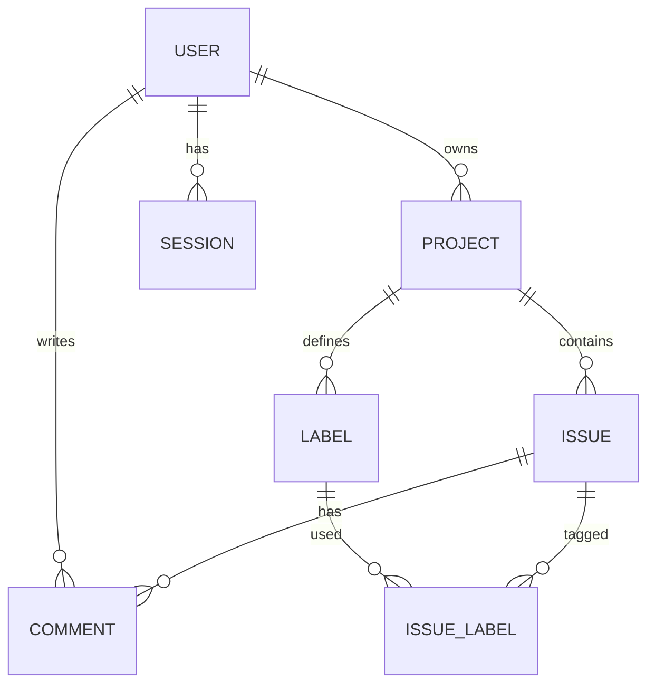

# V1 database relationship design

```mermaid
erDiagram
  USER ||--o{ PROJECT : owns
  USER ||--o{ SESSION : has
  PROJECT ||--o{ ISSUE : contains
  PROJECT ||--o{ LABEL : defines
  ISSUE ||--o{ COMMENT : has
  ISSUE ||--o{ ISSUE_LABEL : tagged
  LABEL ||--o{ ISSUE_LABEL : used
  USER ||--o{ COMMENT : writes
```

Each project has exactly one owner. In the planned issue model, an issue belongs to exactly one project. A label belongs to one project and can tag many issues in that project. A comment belongs to one issue and records its author. An issue may optionally point to the project owner as assignee in V1; when collaboration is added, membership rules must replace this limitation. Every issue-label link must involve a label from the same project as its issue; the future issue service must enforce this, and a composite database constraint can reinforce it.

| Table | Important columns and constraints |
| --- | --- |
| users | `id` UUID PK, `email` unique case insensitive, `password_hash`, `display_name`, timestamps |
| sessions | `id` UUID PK, `user_id` FK, `token_hash` unique, `expires_at`, `revoked_at`, `created_at` |
| projects | `id` UUID PK, `owner_id` FK, `name`, `description`, `archived_at` nullable, timestamps |
| issues | `id` UUID PK, `project_id` FK, `title`, `description`, `type`, `status`, `priority`, `assignee_id` nullable FK, `archived_at` nullable, timestamps |
| labels | `id` UUID PK, `project_id` FK, `name`, `color`, unique `(project_id, name)` |
| issue_labels | `(issue_id, label_id)` composite PK and foreign keys |
| comments | `id` UUID PK, `issue_id` FK, `author_id` FK, `body`, timestamps |

`status` is one of `backlog`, `todo`, `in_progress`, `review`, `done`; `type` is `bug`, `feature`, `task`; `priority` is `low`, `medium`, `high`, `urgent`. Store timestamps in UTC. Generate IDs server-side. Keep authorship when archiving, and do not hard-delete a user who owns retained history. Foreign keys and indexes support project issue queries and session expiration.

The first migration, `0001_create_users`, implements only `users`: a backend-generated
UUID primary key, required `email` (up to 320 characters), `password_hash` (text),
`display_name` (up to 100 characters), and required `created_at`/`updated_at`
timestamps with time zone and database `now()` defaults. A unique expression index
on `lower(email)` enforces case-insensitive uniqueness without an extension.
SQLAlchemy updates `updated_at` on ORM writes; direct SQL updates must set it
explicitly. Database sessions use UTC. Raw SQL inserts must supply a UUID.
Migration `0002_create_sessions` adds persistent authentication sessions. It depends
on `0001_create_users`, which is unchanged:

| Column | Definition |
| --- | --- |
| `id` | Required UUID primary key, generated by the backend |
| `user_id` | Required UUID foreign key to `users.id`; no cascading deletion |
| `token_hash` | Required 64-character SHA-256 hex digest; unique index |
| `expires_at` | Required timestamp with time zone; seven days after login |
| `revoked_at` | Nullable timestamp with time zone; set on logout or session replacement |
| `created_at` | Required timestamp with time zone; database `now()` default |

Indexes cover unique token lookup, `user_id`, and `expires_at`. The raw token is
generated from 32 cryptographically random bytes and exists only in the cookie
and transient application memory. PostgreSQL stores only its digest. Every
authenticated request requires `revoked_at IS NULL` and `expires_at > now()`.
Expiration is enforced even if the browser retains the cookie. Session records
survive API restarts; no in-memory authentication store is used. Expired/revoked
rows remain stored; no cleanup worker is included in this milestone.

Upgrade creates the table and indexes without altering users. Downgrade to
`0001_create_users` drops sessions and invalidates all logins while preserving
users. Issues and the other future tables remain design-only.
See the README for setup and SQL verification.

## Projects: migration 0003_create_projects

Depends on 0002_create_sessions; neither old migration changes. Adds only:

| Column | Definition |
| --- | --- |
| id | Backend-generated UUID primary key |
| owner_id | Required UUID FK to users.id, without cascading deletion |
| name | Required varchar(100), database check rejects blank space-only names |
| description | Nullable varchar(2000); blank API input normalizes to null |
| created_at, updated_at | Required timezone-aware timestamps, database now() defaults |

The ix_projects_owner_created_id index covers owner_id, created_at and id.
The API trims surrounding whitespace and rejects all-whitespace names. Duplicate
names are allowed. ORM updates maintain updated_at; SQL callers must set it.
Migration 0003 does not include archived_at; the new 0004 migration adds it.
No issue or board tables are added here.

Upgrade preserves users and sessions. Downgrade to 0002 removes projects and all
project data, preserving accounts and sessions. Migration 0003 HAS been applied
to the user's local devpilot database, confirmed with a read-only revision check.
Previous documentation saying it was pending was stale.

## Project management: migration 0004_project_archival

Depends on 0003; old migration files remain unchanged. Upgrade adds only
`projects.archived_at`, nullable `timestamp with time zone`, with no default.
All existing rows start active (NULL). Existing IDs, ownership, names,
descriptions, created_at, updated_at, accounts, and sessions remain unchanged.
No additional index is introduced; owner/date/id still supports the ordered list.

Archive sets archived_at to the server's UTC time. Restore sets it to NULL.
ORM writes update updated_at only when values change; repeated archive/restore
requests leave both timestamps unchanged. Services lock the owner-scoped row
before editing or transitioning it. Archived projects cannot be edited until
restored. Listing filters active/archived before applying limit/offset.

Downgrade to 0003 drops only archived_at. It preserves all rows and other fields,
but archive timestamps are irrecoverably lost; a later upgrade treats every
project as active. Use matching older application code if downgrading. Further
downgrade to 0002 deletes projects and is not part of this milestone.

Status: 0004 has been upgraded/downgraded only in a disposable PostgreSQL database
named devpilot_test. **Not applied to local devpilot; explicit user approval is
required.** The new application code requires 0004 before serving project requests.
Tests verify schema/metadata agreement and preservation of project rows, ownership,
timestamps, users, and sessions across downgrade/upgrade. Automated tests do not
use the development database.
