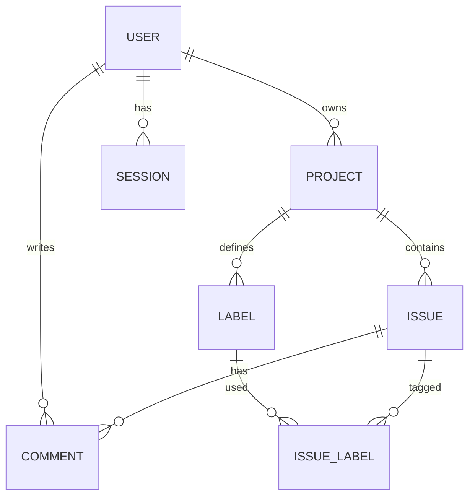

# V1 database relationship design

```mermaid
erDiagram
  USER ||--o{ PROJECT : owns
  USER ||--o{ SESSION : has
  PROJECT ||--o{ ISSUE : contains
  PROJECT ||--o{ LABEL : defines
  ISSUE ||--o{ COMMENT : has
  ISSUE ||--o{ ISSUE_LABEL : tagged
  LABEL ||--o{ ISSUE_LABEL : used
  USER ||--o{ COMMENT : writes
```

Each project has exactly one owner; each implemented issue belongs to exactly one
project. Labels and comments are implemented by migration 0006; assignment and
issue archival remain design-only. Labels must belong
to the same project as their issues. No assignee_id or archived_at is added to
issues in migration 0005.

| Table | Important columns and constraints |
| --- | --- |
| users | `id` UUID PK, `email` unique case insensitive, `password_hash`, `display_name`, timestamps |
| sessions | `id` UUID PK, `user_id` FK, `token_hash` unique, `expires_at`, `revoked_at`, `created_at` |
| projects | `id` UUID PK, `owner_id` FK, `name`, `description`, `archived_at` nullable, timestamps |
| issues | `id` UUID PK, `project_id` FK, `title`, `description`, `type`, `status`, `priority`, `assignee_id` nullable FK, `archived_at` nullable, timestamps |
| labels | `id` UUID PK, `project_id` FK, `name`, `color`, unique `(project_id, lower(name))` |
| issue_labels | `(issue_id, label_id)` composite PK, project_id and composite project foreign keys |
| comments | `id` UUID PK, `issue_id` FK, `author_id` FK, `body`, timestamps |

`status` is one of `backlog`, `todo`, `in_progress`, `review`, `done`; `type` is `bug`, `feature`, `task`; `priority` is `low`, `medium`, `high`, `urgent`. Store timestamps in UTC. Generate IDs server-side. Keep authorship when archiving, and do not hard-delete a user who owns retained history. Foreign keys and indexes support project issue queries and session expiration.

The first migration, `0001_create_users`, implements only `users`: a backend-generated
UUID primary key, required `email` (up to 320 characters), `password_hash` (text),
`display_name` (up to 100 characters), and required `created_at`/`updated_at`
timestamps with time zone and database `now()` defaults. A unique expression index
on `lower(email)` enforces case-insensitive uniqueness without an extension.
SQLAlchemy updates `updated_at` on ORM writes; direct SQL updates must set it
explicitly. Database sessions use UTC. Raw SQL inserts must supply a UUID.
Migration `0002_create_sessions` adds persistent authentication sessions. It depends
on `0001_create_users`, which is unchanged:

| Column | Definition |
| --- | --- |
| `id` | Required UUID primary key, generated by the backend |
| `user_id` | Required UUID foreign key to `users.id`; no cascading deletion |
| `token_hash` | Required 64-character SHA-256 hex digest; unique index |
| `expires_at` | Required timestamp with time zone; seven days after login |
| `revoked_at` | Nullable timestamp with time zone; set on logout or session replacement |
| `created_at` | Required timestamp with time zone; database `now()` default |

Indexes cover unique token lookup, `user_id`, and `expires_at`. The raw token is
generated from 32 cryptographically random bytes and exists only in the cookie
and transient application memory. PostgreSQL stores only its digest. Every
authenticated request requires `revoked_at IS NULL` and `expires_at > now()`.
Expiration is enforced even if the browser retains the cookie. Session records
survive API restarts; no in-memory authentication store is used. Expired/revoked
rows remain stored; no cleanup worker is included in this milestone.

Upgrade creates the table and indexes without altering users. Downgrade to
`0001_create_users` drops sessions and invalidates all logins while preserving
users. Migration 0005 implements core issues; migration 0006 implements labels/comments.
See the README for setup and SQL verification.

## Projects: migration 0003_create_projects

Depends on 0002_create_sessions; neither old migration changes. Adds only:

| Column | Definition |
| --- | --- |
| id | Backend-generated UUID primary key |
| owner_id | Required UUID FK to users.id, without cascading deletion |
| name | Required varchar(100), database check rejects blank space-only names |
| description | Nullable varchar(2000); blank API input normalizes to null |
| created_at, updated_at | Required timezone-aware timestamps, database now() defaults |

The ix_projects_owner_created_id index covers owner_id, created_at and id.
The API trims surrounding whitespace and rejects all-whitespace names. Duplicate
names are allowed. ORM updates maintain updated_at; SQL callers must set it.
Migration 0003 does not include archived_at; the new 0004 migration adds it.
No issue or board tables are added here.

Upgrade preserves users and sessions. Downgrade to 0002 removes projects and all
project data, preserving accounts and sessions. Migration 0003 HAS been applied
to the user's local devpilot database, confirmed with a read-only revision check.
Previous documentation saying it was pending was stale.

## Project management: migration 0004_project_archival

Depends on 0003; old migration files remain unchanged. Upgrade adds only
`projects.archived_at`, nullable `timestamp with time zone`, with no default.
All existing rows start active (NULL). Existing IDs, ownership, names,
descriptions, created_at, updated_at, accounts, and sessions remain unchanged.
No additional index is introduced; owner/date/id still supports the ordered list.

Archive sets archived_at to the server's UTC time. Restore sets it to NULL.
ORM writes update updated_at only when values change; repeated archive/restore
requests leave both timestamps unchanged. Services lock the owner-scoped row
before editing or transitioning it. Archived projects cannot be edited until
restored. Listing filters active/archived before applying limit/offset.

Downgrade to 0003 drops only archived_at. It preserves all rows and other fields,
but archive timestamps are irrecoverably lost; a later upgrade treats every
project as active. Use matching older application code if downgrading. Further
downgrade to 0002 deletes projects and is not part of this milestone.

Status: 0004 was approved and applied to local devpilot; the issues milestone's
read-only check confirmed revision 0004_project_archival. Its rollback tests run
only in the disposable devpilot_test database.
Tests verify schema/metadata agreement and preservation of project rows, ownership,
timestamps, users, and sessions across downgrade/upgrade. Automated tests do not
use the development database.

## Issues: migration 0005_create_issues

Depends on 0004 and leaves all earlier migrations unchanged. Creates only `issues`
and `ix_issues_project_created_id` (project_id, created_at, id).

| Column | Constraint / behavior |
| --- | --- |
| id | UUID primary key; generated by the backend ORM |
| project_id | Required FK to projects.id, no cascade delete |
| title | Required varchar(200), length/non-whitespace check; API trims surrounding whitespace |
| description | Nullable text with a maximum-length check of 10,000; API trims and normalizes blank to null |
| type | Required varchar(16), check: task/bug/feature; server default task |
| status | Required varchar(20), check: backlog/todo/in_progress/review/done; server default todo |
| priority | Required varchar(16), check: low/medium/high/urgent; server default medium |
| created_at, updated_at | Required timezone-aware timestamps, default now(); ORM updates updated_at on actual changes |

The documented five statuses/four priorities are preserved; the title/description
limits and defaults were previously undefined and now follow this milestone's
fallback contract. IDs, ownership, and project membership are immutable in the API.
Issue data is plain text; frontend rendering does not interpret HTML/Markdown.

Writes lock the owning project before checking archived_at and changing issues.
Project archive/restore uses the same row lock. Reads always verify parent
ownership and remain allowed while archived. No deletion, issue archival,
assignment, label, comment, or board table is introduced.

Upgrade preserves all existing projects (including archive timestamps), accounts,
and sessions. Downgrade to 0004 drops the issues table/index and **deletes every
issue**, preserving existing project/account/session data. Do not downgrade a
database containing issue data you want to keep.

**0005 is approved, applied, and verified on local devpilot.**
Alembic reports 0005 (head) and no schema drift. All four existing project rows
were verified unchanged; owner-scoped issue-list reads succeeded for each.
Automated mutation and downgrade tests use only guarded devpilot_test. Tests verify constraints independently of the API,
metadata agreement, and project/archive-state preservation across rollback.

## Board persistence

The Kanban milestone required no migration and used `0005_create_issues`.
Comments/labels subsequently advanced local head to `0006_comments_labels`. Movement updates only the existing issues.status and ORM
updated_at; IDs, project membership, and created_at stay fixed. No board table,
rank, position, or manual-order field is added. Cards retain the API's
created_at DESC, id DESC ordering. The existing status constraint and parent row
lock continue to enforce valid statuses and archived-project restrictions.

## Comments and labels: 0006_comments_labels

Depends on 0005; old migrations remain unchanged. **Local devpilot is now at
0006_comments_labels (head), applied after explicit approval.** Alembic check
reported no schema drift; existing users, sessions, projects and issues were
verified unchanged. Only guarded devpilot_test was downgraded. Read-only label,
issue and comment queries passed against the migrated development schema.

- `comments`: UUID PK, issue_id FK, author_id FK, body text with 1–5,000/nonblank
  check, UTC created_at and updated_at. Index `(issue_id, created_at, id)` supports
  chronological pages. Authors reference retained users; no account cascade.
- `labels`: UUID PK, project_id FK, name varchar(30) with length/trim/nonblank check,
  color enum check using six fixed values (blue default). Unique index on
  `(project_id, lower(name))` handles case-insensitive uniqueness under concurrency.
- `issue_labels`: PK `(issue_id, label_id)`, project_id, reverse label index and
  composite FKs to `(issues.id, issues.project_id)` and `(labels.id, labels.project_id)`.
  This rejects cross-project assignments even through direct SQL. The label FK
  cascades assignment deletion only; issues are preserved.
- Composite unique constraints on issues and labels `(id, project_id)` support
  those FKs. The issues constraint adds an index and briefly locks that table
  during migration; no existing issue values are rewritten.

Upgrade preserves existing users, sessions, projects, archive states and issues.
No labels/comments are backfilled. Downgrade removes the three new tables and
the added issues constraint, **permanently losing all comments, labels and label
assignments**, while retaining previous issue/project/account data. No development
downgrade is authorized or planned. Label deletion preserves issue timestamps;
comment edits update only that comment's updated_at. Same-body edits are no-ops.
